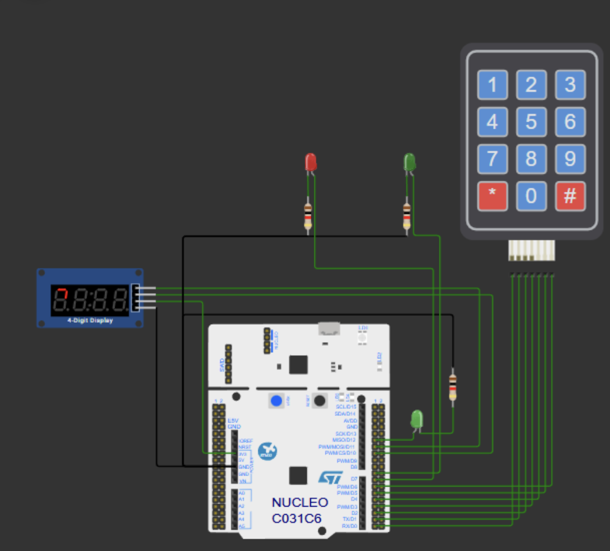

# Мастер-класс 1

  

## Задание для получения варианта

Разработать таймер. Количество секунд задается с помощью клавиатуры и отображается на дисплее. Когда таймер досчитает до 0, то должен загораться светодиод.

### Заготовка

https://wokwi.com/projects/441510423071853569

## Задание по варианту

**Вариант 2**

Разработать систему управления доступом с использованием 4-разрядного семисегментного индикатора, мембранной клавиатуры и светодиодов для имитации процесса ввода кода из 4-ёх цифр.

  

